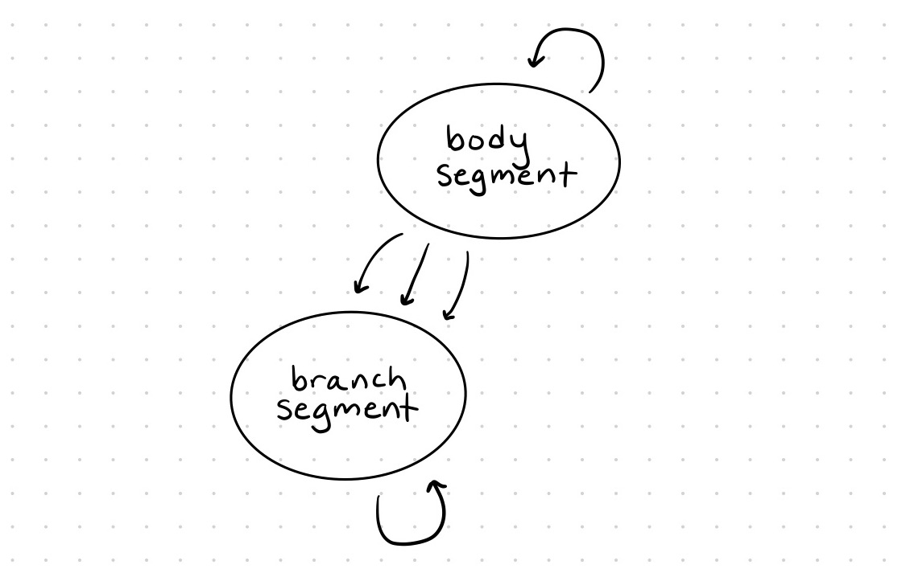
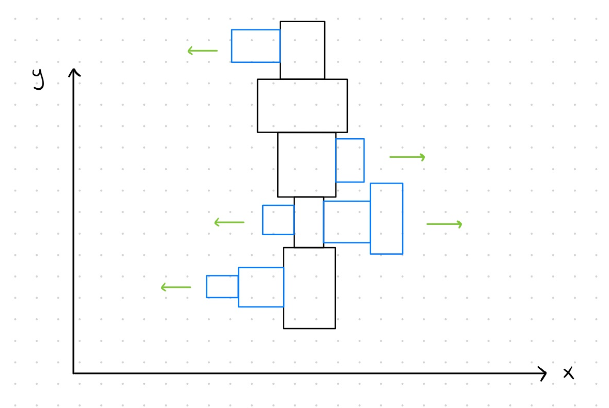
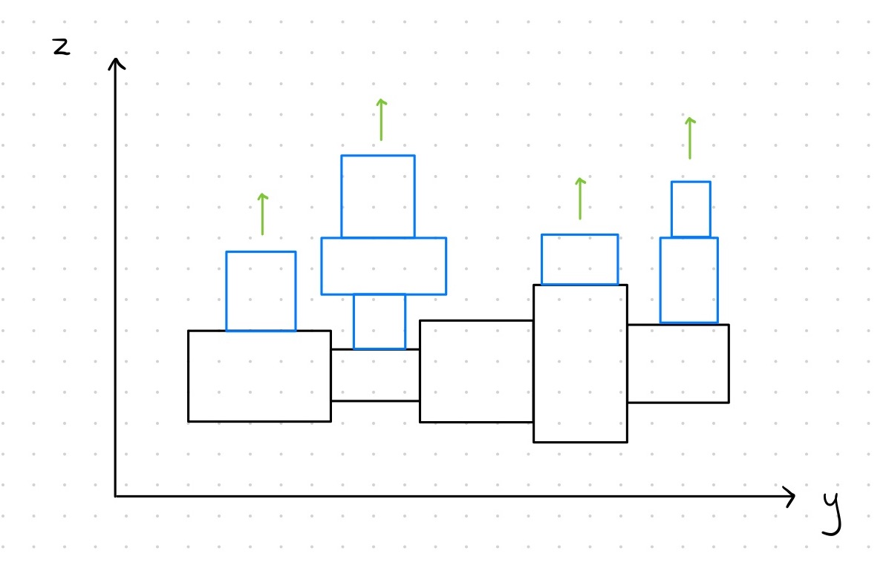

# ludobots: morphospace
This program generates a 3D creature (jointed, motorized, sensorized) with a random number of links (with random dimensions) and random sensor placement. Links with sensors are colored green, and links without sensors are colored blue.

First, a "spine" chain is grown in the y-direction. A random number 'num_links' is generated to determine the number of links in the chain. A "base" link is generated first, positioned at (0, 0) in 2D space. From there, the remaining links (given randomized dimensions) are added to the chain. 

Next, "branches" are added in the x and z directions. For each direction, the program loops through each of the existing links in the "spine." At each iteraction, a (randomly generated) number of links to add in the given direction is produced, and that number of joint-link pairs is added to the given spine link.

The diagram below provides a visual summary of the growth process.

    

Each time a new joint and link pair is generated, a random boolean value is also generated to decide whether or not that link will have a sensor. Sensor neurons are added only for the links for which this boolean is set to True. The link is colored green if the sensor boolean is True, and blue otherwise. Random values for the entire program were generated using the random module.

The diagram below shows an example of branching in the x direction.

    

The diagram below shows an example of branching in the z direction.

    

In both of the diagrams above, the green arrows show the direction of growth of the branch links (colored blue) at each spine link (colored black).

# usage
Run search.py to generate a random kinematic chain.
>python3 search.py

Python package requirements: random, numpy, pybullet

# sources
- Ludobots MOOC on Reddit (https://www.reddit.com/r/ludobots/)
- Evolving Virtual Creatures by Karl Sims (https://www.karlsims.com/papers/siggraph94.pdf)
