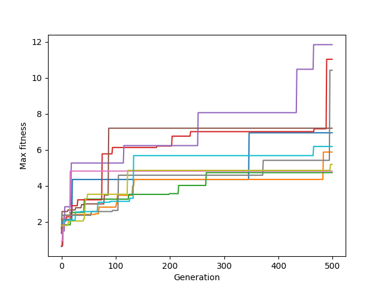

# ludobots
This project showcases the simulated evolution of 3D rigid robots. 

    

Full Video: https://youtu.be/xpdqbzg-Br8 

# robot generation
Robots are composed of 3D blocks called "links" connected by joints, and have sensors that define how the robot moves. This program generates 3D jointed, motorized, and sensorized robots with a random number of links (with random dimensions) and random sensor placement. Links with sensors are colored green, and links without sensors are colored blue.

First, a "spine" chain is grown in the y-direction. A random number 'num_links' is generated to determine the number of links in the chain. A "base" link is generated first, positioned at (0, 0) in 2D space. From there, the remaining links (given randomized dimensions) are added to the chain. 

Next, "branches" are added in the x and z directions. For each direction, the program loops through each of the existing links in the "spine." At each iteraction, a (randomly generated) number of links to add in the given direction is produced, and that number of joint-link pairs is added to the given spine link.

The diagram below provides a visual summary of the growth process.

    

In both of the phenotype diagrams above, the green arrows show the direction of growth of the branch links (colored blue) at each spine link (colored black).

Each time a new joint and link pair is generated, a random boolean value is also generated to decide whether or not that link will have a sensor. Sensor neurons are added only for the links for which this boolean is set to True. The link is colored green if the sensor boolean is True, and blue otherwise. Random values for the entire program were generated using the random module.

Random robot generation occurs in the Create_Body and Create_Brain methods of the SOLUTION class, defined in the solution.py file.

# robot evolution
Evolution was simulated using a parallel hill climber algorithm. In this algorithm, a given number of randomly generated "parent" robots are first instantiated. Then a mutation is made to each parent to produce a child. The fitness of the child is calculated, and if its fitness is greater than that of its respective parent, then the child replaces the parent in the following generation. Thus, this algorithm was able to keep track of the maximum obtained fitess. This process repeats for a given number of generations, at the end of which, the robot with the best fitness overall is selected. This process is illustrated below.

    

The desired motion for this robot was jumping, and the fitness function was thus designed to maximize an increase in z-directional motion.

The parallel hill climber algorithm was implemented in the PARALLEL_HILL_CLIMBER class, defined in the parallelHillClimber.py file.

The type of mutation made for each robot was randomly determined. The possible types of mutations were:
- Increased number of links in the x, y, or z directions
- Decreased number of links in the x, y, or z directions
- The probability of larger links was increased
- The probability of smaller links was increased
- The weight of a random synapse was changed to a random number
To select a mutation, a random integer was generated between 1 and 10, each corresponding to a different mutation. This resulted in a 10% chance of each type of body mutation, and a 20% chance of a mutation that altered a synapse weight. This process is depicted in the following diagram.

    

Robot mutation is implemented in the Mutate method of the SOLUTION class, defined in the solution.py file.

The fitness curves for 500 generations of robots with a population size of 10 robots per generation, using 10 different random seeds (50,000 simulations in total) are shown below.

    

From the fitness curves, it’s evident that evolution was generally successful in producing robots with relatively high fitness values. However, it should be noted that improvements with successive generations were not always large, as seen by the presence of large periods of constant max fitness values on the plot.  A possible explanation of this could be that the robots were always generated by having links that “branched off” an existing structure, so small changes to the body structure or random synapse changes, which is what mutations in this program consisted of, may not have had significant effects on their own. Instead, it appears that happening upon a few mutations that cause significant increases in fitness (or perhaps the cumulative effect of many small mutations) is much more significant to evolution in this program compared to constant incremental increases in fitness with each mutation.

# usage
Run search.py to generate a random kinematic chain.
>python3 search.py

Run analyze.py to generate a fitness plot.
>python3 analyze.py

Run pickled.py to see one of the saved robots.
>python3 pickled.py <robot_number>

e.g. If you would like to run robot 0 in the saved robots, you can run
>python3 pickled.py 0

To see the saved robot data, see the best_robots folder, which contains the body.urdf and brain.nndf of several of the best evolved robots.

The number of generations and population size can be modified by editing the numberOfGenerations and populationSize variables respectively in the constants.py file

Python package requirements: random, numpy, pybullet

# sources
- Ludobots MOOC on Reddit (https://www.reddit.com/r/ludobots/)
- Evolving Virtual Creatures by Karl Sims (https://www.karlsims.com/papers/siggraph94.pdf)
- Project built on pyrosim (https://github.com/jbongard/pyrosim)
